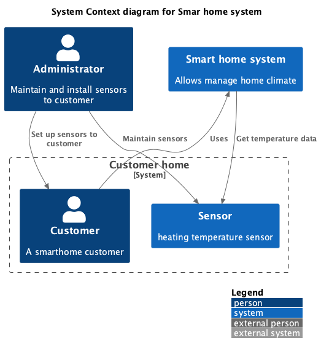
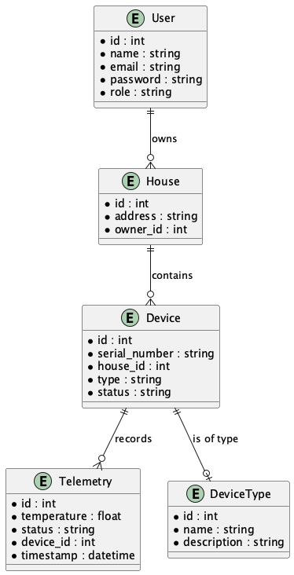
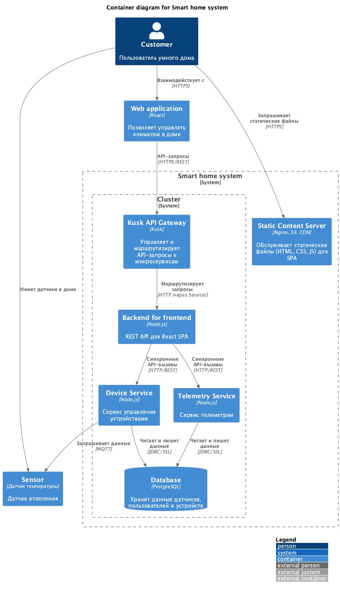
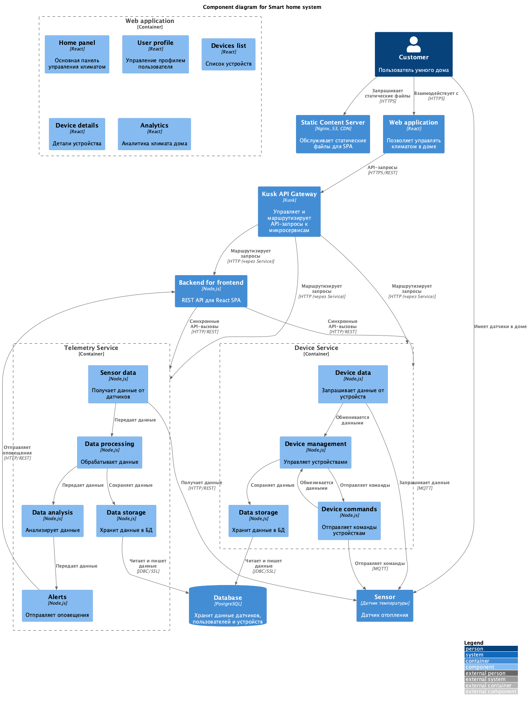

# Task 1

## Domains

- Домен `Упраление прользователями` - отвечает за управление пользователями.
- Домен `Телеметрия` - отвечает за сбор и хранение телеметрии.
- Домен `Управление устройствами` - отвечает за управление устройствами.

## Ключевые микросервисы

- `User Management Service` - отвечает за управление пользователями.
- `Telemetry Service` - отвечает за сбор и хранение телеметрии.
- `Device Management Service` - отвечает за управление устройствами.

## Основные сущности системы и их атрибуты

### User Management Service
- `User` - пользователь
  - `id` - идентификатор
  - `name` - имя
  - `email` - email
  - `password` - пароль
  - `role` - роль

- `House` - дом
  - `id` - идентификатор
  - `address` - адрес
  - `owner_id` - идентификатор владельца

### Telemetry Service
- `Telemetry` - телеметрия
  - `id` - идентификатор
  - `temperature` - температура
  - `status` - статус (вкл/выкл)
  - `device_id` - идентификатор устройства
  - `timestamp` - временная метка

### Device Management Service
- `Device` - устройство
  - `id` - идентификатор
  - `serial_number` - серийный номер
  - `house_id` - идентификатор дома
  - `type` - тип устройства
  - `status` - статус (вкл/выкл)

- `DeviceType` - тип устройства
  - `id` - идентификатор
  - `name` - название
  - `description` - описание

## C4 Diagrams

### Monolith Context Diagram

### Er Diagram

### Containers Diagram

### Components Diagram
  

## OpenAPI

- Спецификация лежит в папке `smarthome/openapi`

# Task 2 (не готов)

- Код лежит в папке smarthome/services (изначально была задумка сделать общение через kafka, но не смог развернуть в кластере чарт от битнами)
- Чарты helm лежат в папке smarthome/charts
  - 

